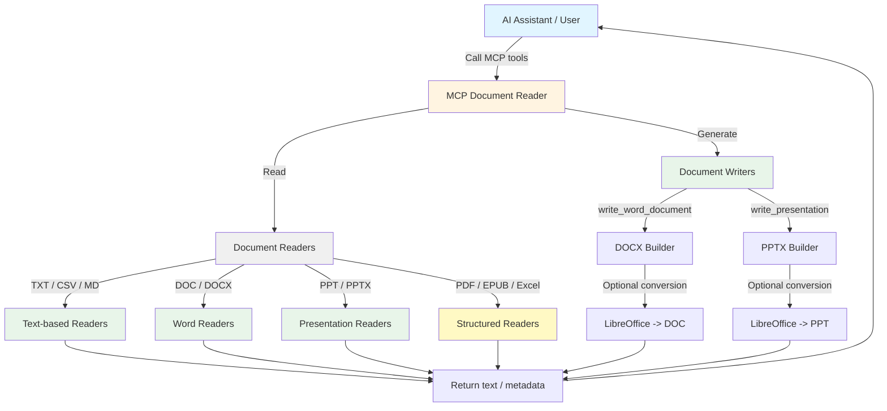

<h1 align="center">MCP Document Reader</h1>

<!-- mcp-name: io.github.xt765/mcp_documents_reader -->

<p align="center"><strong>MCP (Model Context Protocol) Document Reader - A multi-format MCP server for reading and generating Office, PDF, text, EPUB, and presentation documents.</strong></p>

<p align="center">🌐 <strong>Language</strong>: <a href="README.en.md">English</a> | <a href="README.md">中文</a></p>

<p align="center">
  <a href="LICENSE"></a>
  <a href="https://www.python.org/downloads/"></a>
  <a href="https://pypi.org/project/mcp-documents-reader/"></a>
  <a href="https://pepy.tech/project/mcp-documents-reader"></a>
  <a href="https://registry.modelcontextprotocol.io/v0.1/servers?search=io.github.xt765/mcp_documents_reader"></a>
  <a href="https://mcp-marketplace.io/server/io-github-xt765-mcp-documents-reader"></a>
</p>

## Features

- **Read + Write Workflows**: Read documents and generate Word / PowerPoint files from structured payloads
- **Broad Format Support**: Supports TXT, CSV, Markdown, DOC, DOCX, PDF, PPT, PPTX, EPUB, XLSX, and XLS
- **Structured Authoring**: Generate paragraphs, tables, title slides, bullet slides, and presentation tables
- **Legacy Format Export**: Export `.doc` and `.ppt` through LibreOffice conversion when available
- **MCP Protocol**: Compliant with MCP standards, can be used as a tool for AI assistants like Trae IDE
- **Easy Integration**: Simple configuration for immediate use
- **Reliable Performance**: Automated tests cover reading, generation, conversion fallbacks, and tool interfaces
- **File System Support**: Reads and writes documents directly on the file system

---

## 📚 Documentation

[User Guide](docs/en/USER_GUIDE.md) · [API Reference](docs/en/API.md) · [Contributing](docs/en/CONTRIBUTING.md) · [Changelog](docs/en/CHANGELOG.md) · [License](LICENSE)

---

## Architecture



## Supported Formats

| Capability | Format | Extensions | Notes |
|------------|--------|------------|-------|
| Read | Text | `.txt` | Multi-encoding text extraction |
| Read | CSV | `.csv` | Tab-separated normalized output |
| Read | Markdown | `.md`, `.markdown` | Plain markdown text extraction |
| Read | Word | `.doc`, `.docx` | DOC uses command / LibreOffice fallbacks |
| Read | PDF | `.pdf` | Text extraction |
| Read | PowerPoint | `.ppt`, `.pptx` | PPTX native parsing, PPT fallback extraction |
| Read | EPUB | `.epub` | Spine-based section extraction |
| Read | Excel | `.xlsx`, `.xls`, `.xlsm`, `.xlsb`, `.ods` | Sheet and cell extraction; `.xls`/`.xlsb`/`.ods` via calamine / xls2csv / LibreOffice fallback |
| Read | HTML | `.html`, `.htm` | Body text extraction; scripts and styles ignored |
| Read | JSON | `.json` | Parsed and pretty-printed; invalid JSON returns raw text |
| Read | XML / YAML | `.xml`, `.yaml`, `.yml` | Multi-encoding text extraction |
| Read | RTF | `.rtf` | Control-word parsing with body text extraction |
| Write | Word | `.docx` | Native generation with paragraphs and tables |
| Write | Word | `.doc` | Generated via `docx -> doc` LibreOffice conversion |
| Write | PowerPoint | `.pptx` | Native generation with title, text, bullets, tables |
| Write | PowerPoint | `.ppt` | Generated via `pptx -> ppt` LibreOffice conversion |
| Write | Excel | `.xlsx` | Native multi-sheet generation with headers and native cell types |
| Write | CSV | `.csv` | UTF-8 (with BOM) delimited output |
| Write | Excel | `.xls` | Generated via `xlsx -> xls` LibreOffice conversion |

## Installation

### Using pip (Recommended)

```bash
pip install mcp-documents-reader
```

If you need PowerPoint generation, make sure `python-pptx` is available in your runtime environment.

If you need legacy `.doc` or `.ppt` export, install LibreOffice and make sure `soffice` or `libreoffice` is available in `PATH`.

### From Source

```bash
git clone https://github.com/xt765/mcp_documents_reader.git
cd mcp_documents_reader
pip install -e .
```

## MCP Tools

This server provides the following tools:

### `read_document`

Read any supported document type with a unified interface.

**Arguments:**
- `filename` (string, required): Document file path, supports absolute or relative paths.

### `extract_document_images`

Extract embedded images from a DOCX file and return structured JSON metadata.

**Arguments:**
- `filename` (string, required): DOCX file path.
- `output_dir` (string, optional): Optional export directory for extracted images.

### `write_word_document`

Generate a Word document in `.docx`, or export `.doc` via LibreOffice conversion.

**Arguments:**
- `filename` (string, required): Output path ending with `.docx` or `.doc`.
- `title` (string, optional): Document title.
- `paragraphs` (string array, optional): Paragraphs written in order.
- `tables` (object array, optional): Table specs with `title`, `headers`, and `rows`.

### `write_presentation`

Generate a PowerPoint presentation in `.pptx`, or export `.ppt` via LibreOffice conversion.

**Arguments:**
- `filename` (string, required): Output path ending with `.pptx` or `.ppt`.
- `title` (string, optional): Title slide title.
- `subtitle` (string, optional): Title slide subtitle.
- `slides` (object array, optional): Slide specs containing `title`, `paragraphs`, `bullets`, and `table`.

### `write_spreadsheet`

Generate a multi-sheet `.xlsx` spreadsheet or `.csv` file, or export `.xls` via LibreOffice conversion.

**Arguments:**
- `filename` (string, required): Output path ending with `.xlsx`, `.csv`, or `.xls`.
- `sheets` (object array, optional): Sheet specs with `name`, `headers`, and `rows`.
- `headers` (string array, optional): Single-sheet headers (used when `sheets` is empty).
- `rows` (object array, optional): Single-sheet data rows (used when `sheets` is empty).

### `convert_document`

Convert a document to another format via LibreOffice (e.g. `docx -> pdf`).

**Arguments:**
- `filename` (string, required): Source document path.
- `target_format` (string, required): Target extension such as `pdf`, `docx`, `txt`, `html`, `csv`.
- `output_dir` (string, optional): Output directory (defaults to the source directory).

### `list_supported_formats`

List all formats supported for reading and writing as JSON.

**Arguments:** None.

## Configuration

### Using in Trae IDE / Claude Desktop

Add the following to your MCP configuration file:

**Option 1: Using PyPI (Recommended)**

```json
{
  "mcpServers": {
    "mcp-document-reader": {
      "command": "uvx",
      "args": [
        "mcp-documents-reader"
      ]
    }
  }
}
```

**Option 2: Using GitHub repository**

```json
{
  "mcpServers": {
    "mcp-document-reader": {
      "command": "uvx",
      "args": [
        "--from",
        "git+https://github.com/xt765/mcp_documents_reader",
        "mcp_documents_reader"
      ]
    }
  }
}
```

**Option 3: Using Gitee repository (Faster access in China)**

```json
{
  "mcpServers": {
    "mcp-document-reader": {
      "command": "uvx",
      "args": [
        "--from",
        "git+https://gitee.com/xt765/mcp_documents_reader",
        "mcp_documents_reader"
      ]
    }
  }
}
```

## Usage

### As an MCP Tool

After configuration, AI assistants can directly call the following tool:

```python
# Read a DOCX file
read_document(filename="example.docx")

# Read a presentation
read_document(filename="example.pptx")

# Generate a DOCX report
write_word_document(
    filename="report.docx",
    title="Weekly Report",
    paragraphs=["Summary paragraph", "Next actions"],
    tables=[
        {
            "title": "Metrics",
            "headers": ["Name", "Value"],
            "rows": [["Leads", 42], ["Deals", 8]],
        }
    ],
)

# Generate a PPTX deck
write_presentation(
    filename="briefing.pptx",
    title="Quarterly Briefing",
    subtitle="Q2",
    slides=[
        {
            "title": "Highlights",
            "paragraphs": ["Overview paragraph"],
            "bullets": ["Point A", "Point B"],
        }
    ],
)
```

### As a Python Library

```python
from mcp_documents_reader import DocumentReaderFactory

# Using factory (recommended)
reader = DocumentReaderFactory.get_reader("document.pdf")
content = reader.read("/path/to/document.pdf")

# Check if format is supported
if DocumentReaderFactory.is_supported("file.xlsx"):
    reader = DocumentReaderFactory.get_reader("file.xlsx")
    content = reader.read("/path/to/file.xlsx")
```

## Tool Interface Details

### read_document

Read any supported document type.

| Parameter | Type | Required | Description |
|-----------|------|----------|-------------|
| filename | string | ✅ | Document file path, supports absolute or relative paths |

### extract_document_images

Extract embedded images from a DOCX file.

| Parameter | Type | Required | Description |
|-----------|------|----------|-------------|
| filename | string | ✅ | DOCX file path |
| output_dir | string | ❌ | Optional export directory for extracted images |

### write_word_document

Generate DOCX directly or export DOC through LibreOffice conversion.

| Parameter | Type | Required | Description |
|-----------|------|----------|-------------|
| filename | string | ✅ | Output file path ending with `.docx` or `.doc` |
| title | string | ❌ | Optional document title |
| paragraphs | string[] | ❌ | Paragraphs written in order |
| tables | object[] | ❌ | Table specs using `title`, `headers`, and `rows` |

### write_presentation

Generate PPTX directly or export PPT through LibreOffice conversion.

| Parameter | Type | Required | Description |
|-----------|------|----------|-------------|
| filename | string | ✅ | Output file path ending with `.pptx` or `.ppt` |
| title | string | ❌ | Title slide title |
| subtitle | string | ❌ | Title slide subtitle |
| slides | object[] | ❌ | Slide specs containing `title`, `paragraphs`, `bullets`, and `table` |

## Dependencies

### Core Dependencies
- `mcp` >= 1.26.0 - MCP protocol implementation
- `python-docx` >= 1.2.0 - DOCX reading and Word document generation
- `python-pptx` >= 0.6.23 - PowerPoint generation
- `pypdf` >= 6.8.0 - PDF file reading (replaces PyPDF2)
- `openpyxl` >= 3.1.5 - Excel file reading

### Optional Runtime Dependencies
- `LibreOffice` - Required if you want to export legacy `.doc` or `.ppt`
- `antiword` / `catppt` - Optional helpers for legacy `.doc` / `.ppt` reading

### Development Dependencies
- `pytest` >= 8.0.0 - Testing framework
- `pytest-asyncio` >= 0.24.0 - Async testing support
- `pytest-cov` >= 6.0.0 - Coverage reporting
- `basedpyright` >= 0.28.0 - Type checking
- `ruff` >= 0.8.0 - Linting and formatting

## License

This project is open-sourced under the MIT License.

This project is based on the GitHub repository [xt765/mcp_documents_reader](https://github.com/xt765/mcp_documents_reader), with adaptations and enhancements for this open-source release.

Our adaptations mainly add and enhance:
- document image extraction capabilities
- document writing and generation workflows for Word and PowerPoint
- broader MCP-oriented document authoring support

We sincerely thank the original repository author for the foundational work.

## Contributing

Issues and Pull Requests are welcome!

## Related Projects

- [MCP Document Converter](https://github.com/xt765/mcp-document-converter) - MCP document converter supporting multiple format conversions
- [Model Context Protocol](https://modelcontextprotocol.io/) - Official Model Context Protocol documentation
