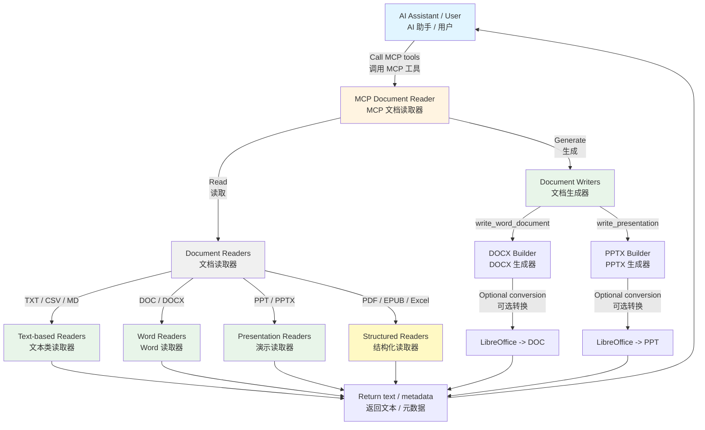

<h1 align="center">MCP Document Reader (MCP 文档读取器)</h1>

<!-- mcp-name: io.github.xt765/mcp_documents_reader -->

<p align="center"><strong>MCP（模型上下文协议）文档读取器 - 一个支持读取与生成 Office、PDF、文本、EPUB 和演示文档的多格式 MCP 服务。</strong></p>

<p align="center">🌐 <strong>语言</strong>: <a href="README.en.md">English</a> | <a href="README.md">中文</a></p>

<p align="center">
  <a href="LICENSE"></a>
  <a href="https://www.python.org/downloads/"></a>
  <a href="https://pypi.org/project/mcp-documents-reader/"></a>
  <a href="https://pepy.tech/project/mcp-documents-reader"></a>
  <a href="https://registry.modelcontextprotocol.io/v0.1/servers?search=io.github.xt765/mcp_documents_reader"></a>
  <a href="https://mcp-marketplace.io/server/io-github-xt765-mcp-documents-reader"></a>
</p>

## 功能特性

- **读写一体**：既能读取文档，也能根据结构化参数生成 Word / PowerPoint 文件
- **广泛格式支持**：支持 TXT、CSV、Markdown、DOC、DOCX、PDF、PPT、PPTX、EPUB、XLSX、XLS
- **结构化写作**：支持段落、表格、标题页、要点页和演示表格生成
- **兼容旧格式导出**：在安装 LibreOffice 时，可导出 `.doc` 和 `.ppt`
- **MCP 协议**：符合 MCP 标准，可作为 AI 助手（如 Trae IDE）的工具使用
- **易于集成**：简单配置即可立即使用
- **可靠性能**：自动化测试覆盖读取、生成、转换回退和工具接口
- **文件系统支持**：直接从文件系统读取和写入文档

---

## 📚 文档中心

[用户指南](docs/zh/USER_GUIDE.md) · [API 参考](docs/zh/API.md) · [贡献指南](docs/zh/CONTRIBUTING.md) · [更新日志](docs/zh/CHANGELOG.md) · [许可证](LICENSE)

---

## 架构



## 支持的格式

| 能力 | 格式 | 扩展名 | 说明 |
|------|------|--------|------|
| 读取 | 文本 | `.txt` | 支持多编码文本提取 |
| 读取 | CSV | `.csv` | 归一化为制表符分隔文本 |
| 读取 | Markdown | `.md`, `.markdown` | 直接提取 Markdown 文本 |
| 读取 | Word | `.doc`, `.docx` | `.doc` 通过命令 / LibreOffice 回退读取 |
| 读取 | PDF | `.pdf` | 提取文本 |
| 读取 | PowerPoint | `.ppt`, `.pptx` | `.pptx` 原生解析，`.ppt` 回退读取 |
| 读取 | EPUB | `.epub` | 基于 spine 顺序提取章节 |
| 读取 | Excel | `.xlsx`, `.xls`, `.xlsm`, `.xlsb`, `.ods` | 提取工作表和单元格内容；`.xls`/`.xlsb`/`.ods` 通过 calamine / xls2csv / LibreOffice 回退读取 |
| 读取 | HTML | `.html`, `.htm` | 提取正文文本，忽略脚本与样式 |
| 读取 | JSON | `.json` | 解析并格式化输出，非法 JSON 回退为原文 |
| 读取 | XML / YAML | `.xml`, `.yaml`, `.yml` | 多编码文本提取 |
| 读取 | RTF | `.rtf` | 解析控制字并提取正文文本 |
| 生成 | Word | `.docx` | 原生生成，支持段落和表格 |
| 生成 | Word | `.doc` | 通过 `docx -> doc` 的 LibreOffice 转换生成 |
| 生成 | PowerPoint | `.pptx` | 原生生成，支持标题、正文、要点、表格 |
| 生成 | PowerPoint | `.ppt` | 通过 `pptx -> ppt` 的 LibreOffice 转换生成 |
| 生成 | Excel | `.xlsx` | 原生生成，支持多工作表、表头和原生数值类型 |
| 生成 | CSV | `.csv` | 生成 UTF-8（含 BOM）分隔文件 |
| 生成 | Excel | `.xls` | 通过 `xlsx -> xls` 的 LibreOffice 转换生成 |

## 安装

### 使用 pip (推荐)

```bash
pip install mcp-documents-reader
```

如果需要 PowerPoint 生成功能，请确保运行环境中可用 `python-pptx`。

如果需要导出旧格式 `.doc` 或 `.ppt`，请安装 LibreOffice，并确保 `soffice` 或 `libreoffice` 已加入 `PATH`。

### 从源码安装

```bash
git clone https://github.com/xt765/mcp_documents_reader.git
cd mcp_documents_reader
pip install -e .
```

## MCP 工具

本服务器提供以下工具：

### `read_document`

使用统一接口读取任何支持的文档类型。

**参数：**
- `filename` (string, 必填): 文档文件路径，支持绝对路径或相对路径。

### `extract_document_images`

提取 DOCX 文件中的嵌入图片，并返回结构化 JSON 元数据。

**参数：**
- `filename` (string, 必填): DOCX 文件路径。
- `output_dir` (string, 可选): 导出图片的目录。

### `write_word_document`

生成 `.docx` Word 文档，或通过 LibreOffice 转换导出 `.doc`。

**参数：**
- `filename` (string, 必填): 输出路径，后缀必须为 `.docx` 或 `.doc`。
- `title` (string, 可选): 文档标题。
- `paragraphs` (string 数组, 可选): 按顺序写入的段落。
- `tables` (object 数组, 可选): 表格定义，支持 `title`、`headers`、`rows`。

### `write_presentation`

生成 `.pptx` 演示文稿，或通过 LibreOffice 转换导出 `.ppt`。

**参数：**
- `filename` (string, 必填): 输出路径，后缀必须为 `.pptx` 或 `.ppt`。
- `title` (string, 可选): 标题页标题。
- `subtitle` (string, 可选): 标题页副标题。
- `slides` (object 数组, 可选): 幻灯片定义，支持 `title`、`paragraphs`、`bullets`、`table`。

### `write_spreadsheet`

生成 `.xlsx` 多工作表电子表格或 `.csv` 文件，或通过 LibreOffice 转换导出 `.xls`。

**参数：**
- `filename` (string, 必填): 输出路径，后缀必须为 `.xlsx`、`.csv` 或 `.xls`。
- `sheets` (object 数组, 可选): 工作表定义，支持 `name`、`headers`、`rows`。
- `headers` (string 数组, 可选): 单工作表表头（未提供 `sheets` 时生效）。
- `rows` (object 数组, 可选): 单工作表数据行（未提供 `sheets` 时生效）。

### `convert_document`

通过 LibreOffice 将文档转换为其他格式（如 `docx -> pdf`）。

**参数：**
- `filename` (string, 必填): 源文档路径。
- `target_format` (string, 必填): 目标扩展名，如 `pdf`、`docx`、`txt`、`html`、`csv`。
- `output_dir` (string, 可选): 输出目录，默认为源文件所在目录。

### `list_supported_formats`

列出所有支持读取与写入的文件格式，返回 JSON。

**参数：** 无。

## 配置

### 在 Trae IDE / Claude Desktop 中使用

将以下内容添加到您的 MCP 配置文件中：

**选项 1：使用 PyPI (推荐)**

```json
{
  "mcpServers": {
    "mcp-document-reader": {
      "command": "uvx",
      "args": [
        "mcp-documents-reader"
      ]
    }
  }
}
```

**选项 2：使用 GitHub 仓库**

```json
{
  "mcpServers": {
    "mcp-document-reader": {
      "command": "uvx",
      "args": [
        "--from",
        "git+https://github.com/xt765/mcp_documents_reader",
        "mcp_documents_reader"
      ]
    }
  }
}
```

**选项 3：使用 Gitee 仓库（国内访问更快）**

```json
{
  "mcpServers": {
    "mcp-document-reader": {
      "command": "uvx",
      "args": [
        "--from",
        "git+https://gitee.com/xt765/mcp_documents_reader",
        "mcp_documents_reader"
      ]
    }
  }
}
```

## 使用方法

### 作为 MCP 工具使用

配置完成后，AI 助手可以直接调用以下工具：

```python
# 读取 DOCX 文件
read_document(filename="example.docx")

# 读取演示文稿
read_document(filename="example.pptx")

# 生成 DOCX 报告
write_word_document(
    filename="report.docx",
    title="周报",
    paragraphs=["本周总结", "下周计划"],
    tables=[
        {
            "title": "指标表",
            "headers": ["名称", "数值"],
            "rows": [["线索", 42], ["成交", 8]],
        }
    ],
)

# 生成 PPTX 汇报
write_presentation(
    filename="briefing.pptx",
    title="季度汇报",
    subtitle="Q2",
    slides=[
        {
            "title": "亮点",
            "paragraphs": ["概述段落"],
            "bullets": ["重点 A", "重点 B"],
        }
    ],
)
```

### 作为 Python 库使用

```python
from mcp_documents_reader import DocumentReaderFactory

# 使用工厂类（推荐）
reader = DocumentReaderFactory.get_reader("document.pdf")
content = reader.read("/path/to/document.pdf")

# 检查格式是否支持
if DocumentReaderFactory.is_supported("file.xlsx"):
    reader = DocumentReaderFactory.get_reader("file.xlsx")
    content = reader.read("/path/to/file.xlsx")
```

## 工具接口详情

### read_document

读取任何支持的文档类型。

| 参数 | 类型 | 必填 | 描述 |
|------|------|------|------|
| filename | string | ✅ | 文档文件路径，支持绝对路径或相对路径 |

### extract_document_images

提取 DOCX 文件中的嵌入图片。

| 参数 | 类型 | 必填 | 描述 |
|------|------|------|------|
| filename | string | ✅ | DOCX 文件路径 |
| output_dir | string | ❌ | 可选的图片导出目录 |

### write_word_document

直接生成 DOCX，或通过 LibreOffice 转换导出 DOC。

| 参数 | 类型 | 必填 | 描述 |
|------|------|------|------|
| filename | string | ✅ | 输出路径，后缀必须为 `.docx` 或 `.doc` |
| title | string | ❌ | 可选文档标题 |
| paragraphs | string[] | ❌ | 按顺序写入的段落 |
| tables | object[] | ❌ | 表格定义，支持 `title`、`headers`、`rows` |

### write_presentation

直接生成 PPTX，或通过 LibreOffice 转换导出 PPT。

| 参数 | 类型 | 必填 | 描述 |
|------|------|------|------|
| filename | string | ✅ | 输出路径，后缀必须为 `.pptx` 或 `.ppt` |
| title | string | ❌ | 标题页标题 |
| subtitle | string | ❌ | 标题页副标题 |
| slides | object[] | ❌ | 幻灯片定义，支持 `title`、`paragraphs`、`bullets`、`table` |

### write_spreadsheet

生成 XLSX / CSV 电子表格，或通过 LibreOffice 转换导出 XLS。

| 参数 | 类型 | 必填 | 描述 |
|------|------|------|------|
| filename | string | ✅ | 输出路径，后缀必须为 `.xlsx`、`.csv` 或 `.xls` |
| sheets | object[] | ❌ | 工作表定义，支持 `name`、`headers`、`rows` |
| headers | string[] | ❌ | 单工作表表头（未提供 `sheets` 时生效） |
| rows | object[] | ❌ | 单工作表数据行（未提供 `sheets` 时生效） |

### convert_document

通过 LibreOffice 转换文档格式。

| 参数 | 类型 | 必填 | 描述 |
|------|------|------|------|
| filename | string | ✅ | 源文档路径 |
| target_format | string | ✅ | 目标扩展名，如 `pdf`、`docx`、`txt`、`html`、`csv` |
| output_dir | string | ❌ | 输出目录，默认为源文件所在目录 |

### list_supported_formats

返回当前支持读写的全部格式列表（JSON）。

| 参数 | 类型 | 必填 | 描述 |
|------|------|------|------|
| - | - | - | 无参数 |

## 依赖

### 核心依赖
- `mcp` >= 1.26.0 - MCP 协议实现
- `python-docx` >= 1.2.0 - DOCX 读取和 Word 文档生成
- `python-pptx` >= 0.6.23 - PowerPoint 文档生成
- `pypdf` >= 6.8.0 - PDF 文件读取（替代 PyPDF2）
- `openpyxl` >= 3.1.5 - Excel 文件读取

### 可选运行时依赖
- `LibreOffice` - 如果要导出旧格式 `.doc` 或 `.ppt`，则必须安装
- `antiword` / `catppt` - 旧格式 `.doc` / `.ppt` 读取时的可选辅助命令

### 开发依赖
- `pytest` >= 8.0.0 - 测试框架
- `pytest-asyncio` >= 0.24.0 - 异步测试支持
- `pytest-cov` >= 6.0.0 - 覆盖率报告
- `basedpyright` >= 0.28.0 - 类型检查
- `ruff` >= 0.8.0 - 代码检查和格式化

## 许可证

本项目以 MIT License 协议开源。

本项目基于优秀的开源项目 [xt765/mcp_documents_reader](https://github.com/xt765/mcp_documents_reader) 进行二次开发，并在其基础上做了进一步增强。

我们当前主要新增和增强了以下能力：
- 文档内图片提取能力
- Word 与 PowerPoint 文档写作、生成工作流
- 面向 MCP 场景的更完整文档创作支持

非常感谢原仓库作者提供的基础能力与开源工作。

## 贡献

欢迎提交 Issue 和 Pull Request！

## 相关项目

- [MCP Document Converter](https://github.com/xt765/mcp-document-converter) - MCP 文档转换器，支持多种格式转换
- [Model Context Protocol](https://modelcontextprotocol.io/) - 模型上下文协议官方文档
